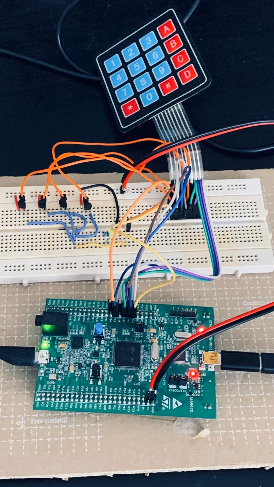

# Keypad HID

This project is an experiment to use a keypad with an STM32F407 DISCOVERY board to create a simple keyboard.

## Components

- STM32F407G-DISC1 board
- keypad
- breadboard

## Schematic

The schematic can be found in the `hardware` folder